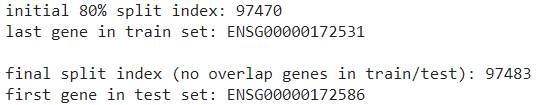

# DSA4262 Project 2: m6A Site Prediction

The problem statement is to develop a machine learning method to identify RNA modifications from direct RNA-Seq data.

Given direct RNA-Seq data and the m6A modification labels, we are to train a model that predicts m6A modification sites on new data. Our training data is from the **Hct116 colon cancer cell line**.

## Project Flow

### 1. Data Parsing

In the data.json file, we are given information on transcript ID, transcript position, nucleotide sequence and a nested list of numbers which represents features extracted from each read at the transcript position as well as the 1-neighbouring position, i.e. 3 features for position 243, followed by 3 features for positions 244 and 245 respectively.

**Illustration of Input File:**

  

For each *(transcript_id, transcript_pos, nucleotide_seq)* triplet, there are a variable number of reads for the 9 features. We decided to take the column means of all reads of these 9 features for each triplet, reducing the total number of rows in the final dataframe, and decreasing the impact of any outlying reads.

**Illustration of Taking Means:**

  

The data.json file is then converted into a dataframe with the following columns:

| transcript_id | transcript_pos | nucleotide_seq | dwell_time_-1 | sd_-1 | mean_-1 | dwell_time_0 | sd_0 | mean_0 | dwell_time_1 | sd_1 | mean_1
|-|-|-|-|-|-|-|-|-|-|-|-|

## 2. Data train-test split

As positions within the same genes might be strongly correlated to each other, there should be no overlapping genes in the train and test split to prevent data leakage.

First, the dataframe is sorted by *gene_id.*
Next, we chose our train size to be 80% of the full dataset. Hence, the initial split index is calculated with `$0.8 * len(dataframe).`
Lastly, by inspecting the dataframe from the initial split index onwards, the actual split index is chosen where the gene_id is different from the previous index’s *gene_id.*

**Illustration of Train-Test Split:**

  

### 2. Feature Engineering
We were also given an additional column known as the “nucleo_seq” which describes the 7-mer nucleotide sequence. Since the sequence cannot be passed as an input into a machine learning model, some feature engineering has to be done.

After doing some research, we tried out several methods likes:
1. Hashing (Fowler-Noll-Vo and MurmurHash)
2. One-hot Encoding
3. Position Weight Matrix
4. "GGACT" Sequence Present

### 3. Feeature Selection

After feature engineering, our training dataset had `46` feature columns and we decided to apply the **Recursive Feature Elimination (RFE)** method to reduce the dimension of our training data (to prevent overfitting).

### 4. Model Evaluation

| **Models** | **Accuracy** | **ROC-AUC** | **PR-AUC** |
| ------------- | ------------- | ------------- | ------------- |
| Naive Model | 96.12% | 50.00% | 3.87% |
| XGBoost w/ 9 Original Columns | 96.10% | 87.27%  | 37.86% |
| XGBoost w/ 22 Selected Features | 96.10% | 88.70%  | 42.78% |
| LightGBM w/ 30 selected Features | 96.61% | 88.66% | 43.44% |

## 5. Demo

Click [here](https://github.com/luajunan/DSA4262-ateam/tree/main/Training%20and%20predicting%20pipeline) to train/predict using the pipeline we created!
